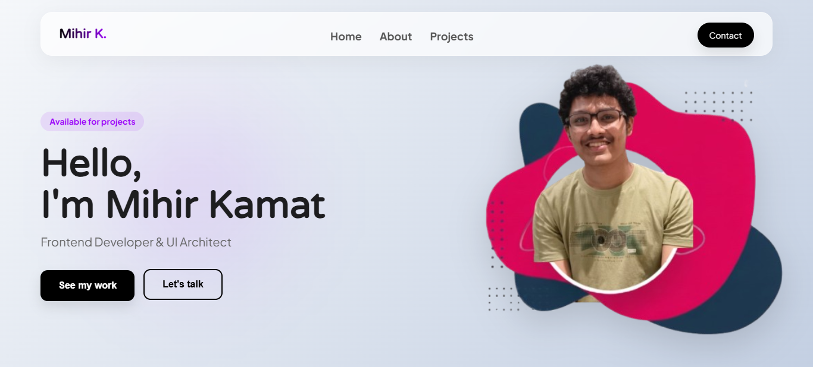

# 🚀 Mihir Kamat | Portfolio 2026

A high-performance, responsive portfolio showcasing the intersection of **Frontend Development**, **UI/UX Design**, and **AI Integration**. This site is built with a focus on modern design trends like **Bento Grids**, **Glassmorphism**, and **Interactive Micro-animations**.



---

## ✨ Key Projects

### 🍔 QuickBite
* **Description**: A high-performance digital cafeteria ecosystem that eliminates campus congestion by integrating secure student verification with real-time queue orchestration and zero-latency order tracking.
* **Tech Stack**: HTML5 • CSS3 (Glassmorphism) • Vanilla JavaScript (ES6+) • Firebase Realtime Database • Firebase Authentication • LocalStorage API
* **Innovation**: Engineered a hybrid state management system merging LocalStorage with Firebase to ensure zero-latency cart interactions and seamless cross-device persistence.

### 🧠 NexoraAI
* **Description**: A smart learning assistant that solves academic problems via image recognition.
* **Tech Stack**: React, Vision-Language APIs, CSS Mesh Gradients.
* **Innovation**: Integrated OCR to transform raw images into step-by-step pedagogical solutions in under 3 seconds.

### 📘 IndoLearn Dashboard
* **Description**: An educational dashboard concept featuring clean bento-box layouts and progress tracking.
* **Tech Stack**: HTML5, Modern CSS (Grid/Flexbox), Chart.js.
* **Innovation**: Real-time student analytics visualized through a modular, adaptive interface.

---

## 🎨 Design System


This portfolio follows a strict 2026 design language:
* **Layout**: Modular Bento Grid for clean information hierarchy.
* **Depth**: Frosted-glass components using `backdrop-filter: blur()`.
* **Interactivity**: High-performance custom cursor following the `.animate()` API for smooth 60fps movement.
* **Theme**: Fully integrated Dark Mode with persistent `localStorage` states.

---

## 🛠️ Tech Stack

| Category | Technology |
| :--- | :--- |
| **Frontend** | HTML5, CSS3 (SCSS), JavaScript (ES6+) |
| **Animation** | Keyframes, Web Animations API |
| **AI/API** | Vision API, Google Gemini API Bridge |
| **Deployment** | GitHub Pages / Vercel |

---

## 🚀 Getting Started

To run this project locally:

1. **Clone the repository**:
   ```bash
   git clone https://github.com/mihirkamat03/portfolio.git

📩 Contact & Socials

Email: kamatmihir.cse@gmail.com

Phone: +91 7021296177

LinkedIn: https://www.linkedin.com/in/mihirkamat/

Portfolio: https://mihirkamat03.github.io/portfolio/
